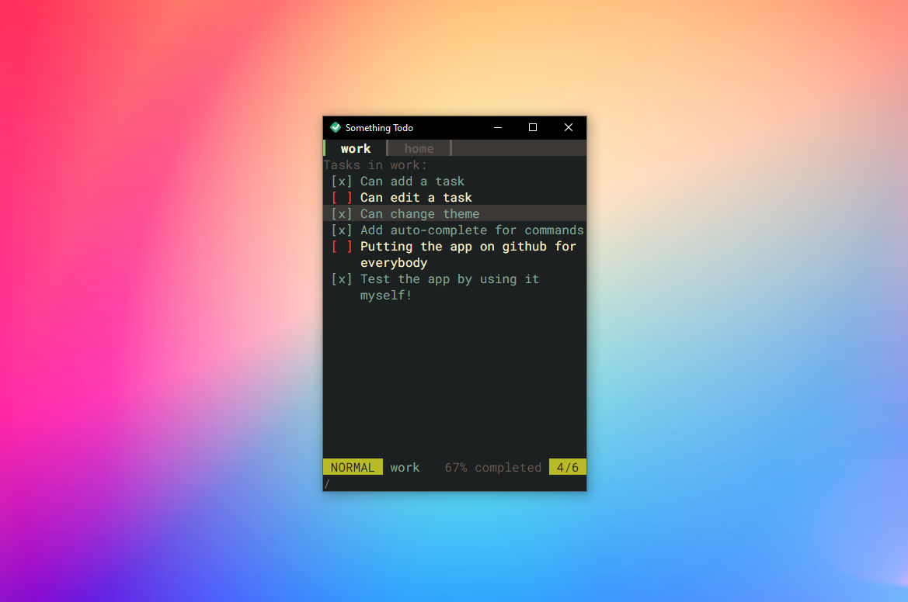

# Something Todo
[There is always something todo](https://www.tiktok.com/@leroyandleroy). A simple [Tauri](https://tauri.app/) based todo-list app inspired by [vim](https://neovim.io/). This app only works with the keyboard. Everything can be done directly and easily with the keyboard. If you have used vim before, you will find yourself at home.

 - Many (200+) [different themes](https://glitchbone.github.io/vscode-base16-term/#/) are available to choose from. They are all generated from the base-16 repository, your [favorite theme](https://vscodethemes.com/e/aedit.ugly-like-me/ugly-like-me) may be supported!
 - Use the [home row](https://stackoverflow.com/questions/6698521/vim-users-where-do-you-rest-your-right-hand) (`H`, `J`, `K` and `L`) or the arrow keys to navigate the app.
 - Use `<Space>` to check or uncheck a task.
 - Use `<Slash>` (`/`) to enter command mode and start typing a command (see the commands list bellow).
 - Organize your tasks with different lists of tasks.
 - [Lightweight](https://blog.logrocket.com/why-use-electron-alternative/) bundle size

---



---

## Commands 

#### `/add <task>`
Add a task to the active list where `task` is the task to add.

#### `/remove`
Remove the highlighted task from the active list.

#### `/edit <newtask>`
Edit the highlighted task from the active list. Replace the highlighted with `newtask`.

#### `/openList <list>`
Open or create a list where `list` is the name of the list.

#### `/deleteList`
Delete the active list. This action is permanent.

#### `/renameList <newname>`
Rename the active list where `newname` is the new name of the list.

#### `/closeList`
Close the active list. Can be opened again with `/openList`.

#### `/help`
Show the help menu.

#### `/lists` or `/ls`
Show a list of all the lists.

#### `/theme`
Change the theme of the app where `theme` is the name of the theme. Many base-16 themes are supported, see the list [here](https://glitchbone.github.io/vscode-base16-term/#/)

## Development
You need [cargo](https://crates.io/) and [nodejs](https://nodejs.org/en/) installed.
```
# Clone this repo
git clone https://github.com/xavierhamel/something-todo

# Enter in the directory
cd something-todo

# Build or start development server
npm run tauri dev
# or
npm run tauri build
```

## License
MIT - Enjoy!
